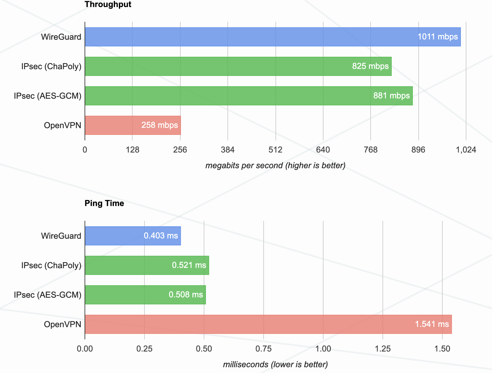

# WireGuard VPN With Dashboard + AdGuard Home

WireGuard VPN is by far the fastest and easiest VPN both in terms of setup and resource consumption. 
The WireGuard + AdGuard Home bundle allows you to set up a private, 
private local network with maximum bandwidth, protected from advertising and tracking, 
as well as protection from various phishing attacks.

For the best VPN server organization we recommend hosting company [Fofnex.com](https://fornex.com/c/fff118/)



Using this repository you can easily set up a full-fledged VPN server in a couple of minutes in a Docker container. You only need to execute a few commands.
First of all you need to install Docker, you can find the installation instructions on the official [Docker website](https://docs.docker.com/engine/install/)

After installing Docker, you need to clone this repository. To do this, run the command:

```shell
git clone https://github.com/LadDev/WGDashboard-by-LadDev.git wgdasghboard
cd wgdashboard
```
After that, you need to build the Docker image with the following command:

```shell
docker build -t wgdashboard .
```
And all that's left is to run the docker container command:
```shell
docker run -d --privileged\
-v /var/docker/adguard/workdir:/opt/adguardhome/work\
-v /var/docker/adguard/confdir:/opt/adguardhome/conf\
-v /var/www/api/db:/data/db\
-p 10085:10085 -p 51820:51820/udp\
--restart unless-stopped\
-p 53:53/tcp -p 53:53/udp\
-p 67:67/udp -p 68:68/udp\
-p 80:80/tcp -p 443:443/tcp -p 443:443/udp\
-p 3000:3000/tcp -p 853:853/tcp -p 784:784/udp\
-p 853:853/udp -p 8853:8853/udp\
-p 5443:5443/tcp -p 5443:5443/udp --name wgdashboard wgdashboard
```

Pay attention to open ports. **10085** is the port of the WireGuard administration panel, where you can configure configurations and manage peers

Port **51820/udp** is the WireGuard client connection port. If you will use a different port in your configuration or have multiple configurations, 
then you will need to open additional UDP ports for users to connect to.


All other ports are required for AdGuard Home to work

Once the container is successfully launched you will have access to the administration panel at http://localhost:10085/login.
The default login and password is **admin**. Do not forget to change the password to access the administration panel, 
as well as change the DNS server settings on AdGuard Home at http://localhost:10085/settings.

As DNS server you can specify directly the internal address of the WireGuard server you configured and started on the page http://localhost:10085/home.

For example, if you specified the address **10.0.0.0.1/24** in the VPN server configuration, 
the DNS server address will be **10.0.0.1**. 
You can also specify the external address of the DNS server, 
but then AdGuard Home will not display the IPs of the VPN clients that made the requests. 
You can specify 3 different DNS servers in the server settings. 

For example: **10.0.0.1, 1.1.1.1, 8.8.4.4**

Here **10.0.0.1** is the address of your DNS server and the other addresses are the DNS servers of Google.

This WireGuard + AdGuard Home bundle allows you to set up a VPN for the whole family and configure visit restrictions for certain users, including the ability to set up parental controls

In order to configure AdGuard Home after launching the Docker container, you need to go to: http://localhost:3000 and configure AdGuard

If you like our build, you can support us with donations to motivate the development of the project:

USDT TRC-20: **TZ1amusaxdQpNPsGjZEjL2CHadELZjUjKW**

Bitcoin: **bc1qs84v8p2mhjcz7k27usz4jlgu3xnw5auqzzuwy7**

Ethereum: **0xF8002A09B0a02c64884d08478cAb32659edF8531**
